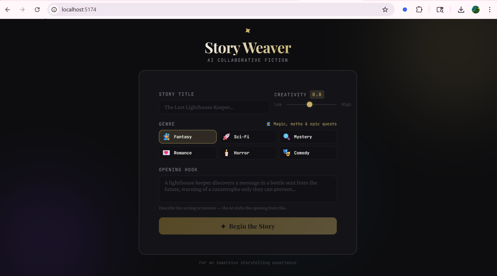
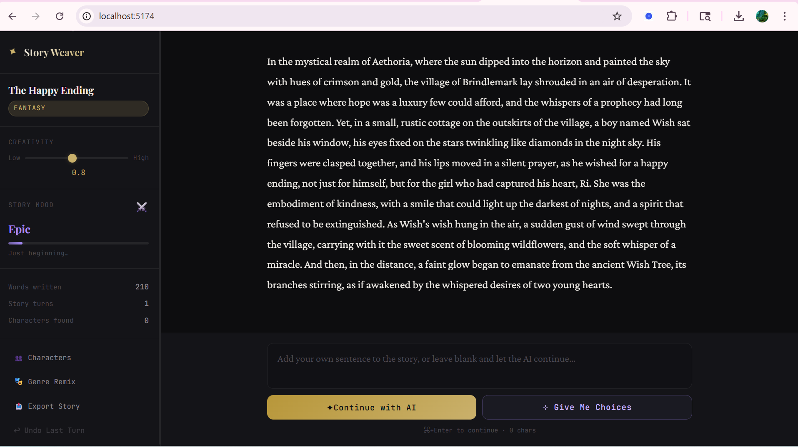
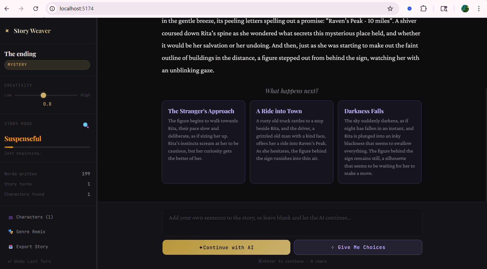
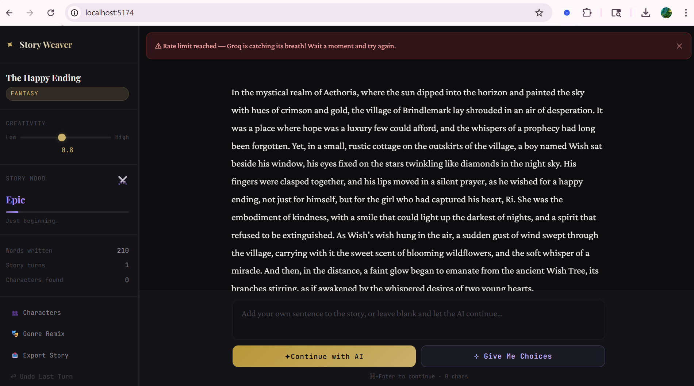

# Story Weaver — AI Collaborative Fiction

A polished, AI-powered collaborative storytelling app built with React + TypeScript and the Groq API.

## Screenshots







![Characters] (screenshot 4.png)


---

## Setup Instructions

### 1. Prerequisites

- Node.js 18+ and npm
- A free [Groq API key](https://console.groq.com)

### 2. Install Dependencies

```bash
npm install
```

### 3. Add Your API Key

```bash
cp .env.example .env
```

Open `.env` and replace the placeholder:

```
VITE_GROQ_API_KEY=your_actual_groq_api_key_here
```

### 4. Run the App

```bash
npm run dev
```

Open [http://localhost:5173](http://localhost:5173) in your browser.

### 5. Build for Production

```bash
npm run build
```

---

## Model & Provider

**Provider:** [Groq](https://groq.com)  
**Model:** `llama-3.3-70b-versatile`

Groq was chosen for its exceptional inference speed (tokens/sec far above other providers) and its generous free tier. The `llama-3.3-70b-versatile` model offers the best balance of creative writing quality and instruction-following for this use case.

---

## System Prompt & Prompt Engineering

The system prompt is dynamically constructed per-request and includes:

1. **Genre-specific rules** — Each genre has a tailored set of writing instructions (e.g., Horror emphasizes building dread slowly; Mystery enforces careful clue-planting)
2. **Character context injection** — All known characters and their descriptions are appended to the system prompt to enforce consistency
3. **Explicit consistency rules** — The model is instructed to never contradict earlier story elements
4. **Style directives** — Third-person narrative, sensory detail, "show don't tell", always end with a hook

```
You are a masterful collaborative fiction writer working on a [Genre] story titled "[Title]".

GENRE RULES — [GENRE]:
[Genre-specific instructions]

YOUR CORE RESPONSIBILITIES:
1. Stay 100% consistent with ALL previous events, character personalities, decisions, and world rules
2. NEVER contradict or retcon earlier story elements
3. Write in vivid, immersive third-person narrative voice
4. Match the tone and style established in previous segments
5. Keep prose concise but evocative — every word earns its place
6. Maintain narrative momentum and forward tension

KNOWN CHARACTERS (maintain strict consistency):
- [Character Name]: [description]
...

WRITING STYLE:
- Show, don't tell — use sensory detail and action
- Vary sentence length for rhythm
- End segments with a hook that pulls the reader forward
- Never summarize what just happened — always push forward
```

---

## Memory & Consistency Strategy

**Full history in every request.** The entire story is sent with every API call as a structured message array:

- AI-generated segments → `role: "assistant"` messages
- User contributions → `role: "user"` messages with a `[Player contribution]:` prefix

This gives the model its full conversational context window for every generation, making it impossible to "forget" earlier events.

**Character tracking.** After each AI turn, a lightweight extraction call pulls named characters from the full story text. These characters are injected into the system prompt, acting as an explicit memory layer that persists across turns.

**Why this works:** Rather than summarization or embeddings (which can lose detail), sending the full history takes advantage of Groq's fast inference — the latency overhead is minimal even for long stories.

---

## Bonus Features Implemented

| Feature | Description |
|---|---|
| ✅ **Genre Remix** | Rewrites the latest AI paragraph in any other genre while preserving all plot events |
| ✅ **Character Tracker** | Auto-extracts named characters after every AI turn; displays with color-coded avatars in the sidebar |
| ✅ **Export as Markdown** | Exports the full story with title, genre, character list, and formatted narrative |
| ✅ **Undo Last AI Turn** | Removes the last AI segment (and user contribution) from history |
| ✅ **Mood Indicator** | Visual indicator showing the story's emotional intensity based on genre and story length |
| ✅ **Give Me Choices** | Generates 3 distinct branching options; user selects one and the story continues accordingly |
| ✅ **Temperature Slider** | Available on both setup and story screens; affects creativity vs. coherence |
| ✅ **Rate Limit Handling** | Friendly error messages for 429, 401, and missing API key errors |

---

## One Thing That Didn't Work Well At First

**Initial problem:** The "Give Me Choices" feature returned malformed JSON about 30% of the time. The model would wrap the JSON in markdown code fences (` ```json ... ``` `) or add an introductory sentence like "Here are your choices:".

**What I changed:** Added a cleaning step that strips markdown fences before `JSON.parse()`, and added a hardcoded fallback array for when parsing still fails. I also made the prompt more explicit: *"Respond ONLY with valid JSON in this exact format, no other text"* and provided a concrete example of the expected output format inline in the prompt.

---

## What I Would Improve With Another Day

1. **Streaming responses** — Currently the full continuation arrives at once. Streaming the tokens would make it feel dramatically more alive, like watching someone type.

2. **Story summary compression** — For very long stories (20+ turns), the full history could hit token limits. I'd add a background summarization step that compresses older segments into a compact "story so far" block while keeping the last 3-4 turns in full.

3. **Persistent storage** — LocalStorage or IndexedDB to save stories across sessions. Right now, refreshing loses everything.

4. **DALL·E / Flux image generation** — The mood indicator is a start, but generating a scene image for the latest paragraph would be a compelling visual addition.

5. **Better mobile layout** — The sidebar + main layout works great on desktop but needs a drawer/sheet pattern on small screens.

6. **Adaptive Reading Modes (Light/Dark/Sepia)** — Currently, the UI is fixed. I would implement a theme engine to allow users to switch between Light, Dark, and a "Reading/Sepia" mode (lower contrast) to reduce eye strain during long collaborative sessions.

---

## Tech Stack

- **React 18** + **TypeScript** + **Vite**
- **Groq API** (llama-3.3-70b-versatile)
- **Lucide React** for icons
- **Google Fonts** — Playfair Display + Crimson Pro + JetBrains Mono
- Zero UI libraries — all styles hand-written in CSS
